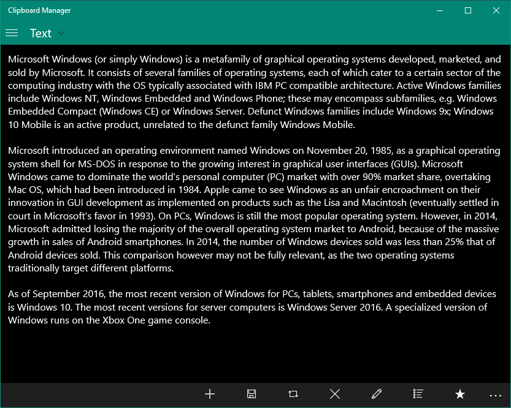

# ClipboardManager
The ClipboardManager app is an modern app that written in C++ on UWP platform of Windows 10 and allows to work with the Windows clipboard.

## System Requirements
The Clipboard Manager app supports x86, x64 ARM and ARM64 versions of Windows OS. The app is compatible with Windows 10 version 1809 and can be work on higher versions of Windows 10.

## Building
For building the ClipboardManager app or creating UWP app package is needed to open [src\ClipboardManager.sln](./src/ClipboardManager.sln) in Visual Studio where in solution is located `ClipboardManager` project.
